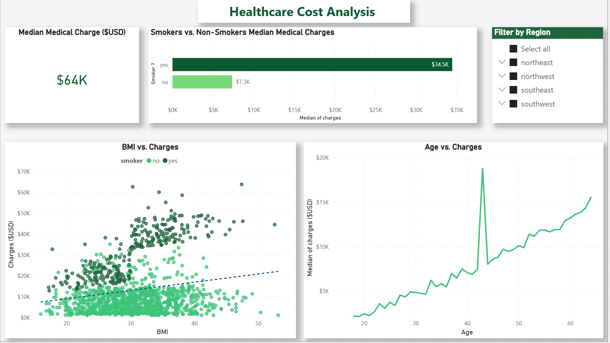

#  Healthcare Cost Analysis & Prediction

## Overview

This project analyzes healthcare data to identify key factors influencing medical costs and builds a predictive model to estimate expenses.

---

##  Tools & Technologies

* Python (Pandas, Seaborn, Scikit-learn)
* Power BI
* Excel

---

##  Key Insights

*  Smokers incur **3–4x higher medical costs**
*  Age and BMI show **moderate impact**
*  Number of children has **minimal effect**
*  Region and gender have **low influence**
*  Lifestyle factors dominate over demographics

---

##  Model Performance

*  R² Score: **0.78**
*  Mean Absolute Error: **~4181**

---

##  Dashboard Preview



---

##  Project Structure

```bash
data/        → dataset  
notebook/    → analysis & ML model  
dashboard/   → Power BI dashboard  
images/      → visuals  
```

---

##  Conclusion

Smoking is the most significant factor affecting medical costs, followed by BMI and age. The model provides reliable predictions and actionable insights for cost optimization.
